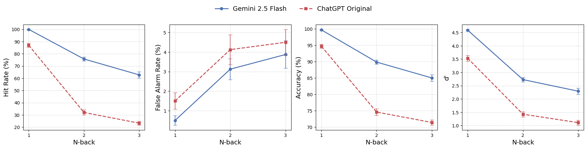

# Assessing Working Memory Capacity of Large Language Models: An Empirical Comparison Between Gemini 2.5 Flash and ChatGPT

## Abstract
Working memory (WM) is a fundamental cognitive system responsible for the temporary storage and manipulation of information. As Large Language Models (LLMs) grow increasingly sophisticated, understanding their cognitive-like capacities becomes essential. Building upon the experimental framework introduced in the AAAI 2024 paper *Working Memory Capacity of ChatGPT: An Empirical Study*, this project evaluates the working memory capacity of Google's Gemini 2.5 Flash model using the classic $N$-back task. We conducted comprehensive experiments across 1-back, 2-back, and 3-back difficulty levels, executing 50 blocks per level to ensure statistical robustness. Our findings demonstrate that Gemini 2.5 Flash significantly outperforms the original ChatGPT baseline across all difficulty levels. While both models exhibit a characteristic decay in performance as $N$ increases—mirroring human cognitive load limitations—Gemini maintains a notably higher detection sensitivity ($d'$). Through rigorous non-parametric statistical testing, including Kruskal-Wallis and Mann-Whitney U tests, we establish that this performance gap is statistically significant. This report details the methodology, statistical analysis, and cognitive implications of these findings, contributing to the broader understanding of state-dependent information tracking in modern transformer architectures.

---

## 1. Introduction
The advent of Large Language Models (LLMs) has revolutionized artificial intelligence, demonstrating remarkable proficiency in natural language understanding, reasoning, and generation. However, the internal mechanisms by which these models track, update, and manipulate state across a sequence of tokens remain an active area of research. In human cognition, this capability is governed by **Working Memory (WM)**, a limited-capacity system that temporarily holds and processes information necessary for complex tasks such as learning, reasoning, and comprehension.

While LLMs possess strictly defined mathematical "context windows," raw context length does not inherently equate to working memory. Working memory requires not just passive retrieval, but the **active maintenance and dynamic updating** of information. To evaluate this specific capability, cognitive psychology relies heavily on the **$N$-back task**, an established paradigm where subjects must indicate whether a current stimulus matches the stimulus presented $N$ steps prior.

In 2024, Dong et al. published an empirical study evaluating the original ChatGPT on verbal and spatial $N$-back tasks, revealing that while the model could perform the task, its accuracy dropped precipitously as $N$ increased. Since that baseline was established, architectural advancements have led to models like Google's Gemini 2.5 Flash, which boasts improved attention mechanisms, massive context windows, and refined instruction-following capabilities. 

This individual project seeks to answer a primary research question: **How does the working memory capacity of a modern, highly optimized model like Gemini 2.5 Flash compare to the baseline established by the original ChatGPT?** By recreating the exact experimental conditions of the original study and applying rigorous statistical testing, this report provides a definitive comparison of their cognitive-like capacities.

---

## 2. Related Work

### 2.1. Working Memory in Human Cognition
In cognitive psychology, the foundational model of working memory was proposed by Baddeley and Hitch (1974). It consists of a central executive that coordinates subsidiary systems, such as the phonological loop (for verbal/acoustic information) and the visuospatial sketchpad. The $N$-back task, introduced by Kirchner (1958), is uniquely suited for measuring the central executive's capacity because it forces the subject to continuously encode new stimuli, compare them to a shifting target in memory, and update the memory buffer by discarding older stimuli.

### 2.2. Context Windows vs. Working Memory in Transformers
Transformer models rely on self-attention mechanisms to weigh the relevance of past tokens. Initially, it was assumed that a longer context window directly translated to better information retention. However, subsequent studies (e.g., Liu et al., "Lost in the Middle") demonstrated that LLMs often struggle to retrieve information embedded in the middle of long contexts. Furthermore, passive retrieval is distinct from the active updating required by the $N$-back task. When an LLM performs an $N$-back task, it must implicitly learn to suppress the attention weights of $N-1$ tokens and strongly attend only to the $N$th token back, a shifting target that changes at every generation step.

### 2.3. The Original ChatGPT Baseline
The baseline for this project is derived from the AAAI 2024 paper by Dong et al. They found that ChatGPT could successfully perform a 1-back task but experienced severe performance degradation at 2-back and nearly failed at 3-back. Their study utilized Signal Detection Theory (SDT) to calculate $d'$ (detection sensitivity), providing a robust, bias-free metric of the model's true working memory capacity.

---

## 3. Methodology

### 3.1. The $N$-back Task Paradigm
The core evaluation mechanism is the verbal $N$-back task. The model is presented with a sequence of letters, delivered one at a time. For each letter, the model must output:
- **`m` (match)**: If the current letter is identical to the letter presented $N$ steps previously.
- **`-` (non-match)**: If the current letter is different from the letter presented $N$ steps previously.

We evaluated three difficulty levels: **1-back, 2-back, and 3-back**.

### 3.2. Dataset and Experimental Setup
To ensure a fair and direct comparison with the original study, we utilized the identical dataset provided in the ChatGPT-WM repository.
- **Blocks**: 50 independent blocks per $N$-back level.
- **Trials**: Each block contains 30 trials.
- **Distribution**: Every block contains exactly 10 match trials (targets) and 20 non-match trials (lures), preventing the model from achieving high accuracy by simply guessing the majority class.
- **Model**: `gemini-2.5-flash` accessed via the official Google GenAI Python SDK.
- **Temperature**: Set to `0.0` to ensure deterministic, highly reproducible outputs.

### 3.3. Prompt Engineering
The system instruction was designed to enforce strict structural adherence. The prompt was dynamically formatted based on the difficulty level $N$:

> "You are asked to perform a {N}-back task. You will see a sequence of letters. Your task is to respond with 'm' (no quotation marks, just the letter m) whenever the current letter is the same as the {target_description}, and '-' (no quotation marks, just the dash sign) otherwise. Only 'm' and '-' are allowed responses. No explanations needed: please don't output any extra words!! The sequence will be presented one letter at a time. Now begins the task."

*(Where `target_description` was logically mapped to "previous one", "letter two trials ago", or "letter three trials ago").*

### 3.4. Evaluation Metrics
We rely on Signal Detection Theory (SDT) to evaluate performance, preventing response bias (e.g., a model constantly outputting '-') from artificially inflating scores.
1. **Hit Rate (HR)**: The percentage of correct 'm' responses out of all true match trials.
2. **False Alarm Rate (FAR)**: The percentage of incorrect 'm' responses out of all true non-match trials.
3. **Accuracy**: The overall percentage of correct responses.
4. **Detection Sensitivity ($d'$)**: The standard metric in cognitive psychology for signal detection, calculated as the difference between the $Z$-scores of the Hit Rate and False Alarm Rate:
   $$ d' = Z(HR) - Z(FAR) $$
   *Note: HR and FAR were clipped to a range of [0.01, 0.99] to prevent infinite $Z$-scores.*

---

## 4. Results

### 4.1. Descriptive Statistics and Performance Comparison
We executed the full suite of 150 blocks (50 blocks $\times$ 3 levels) on Gemini 2.5 Flash and compared the summary statistics against the original ChatGPT baseline.

*(Insert Performance Curves Chart here: Reference the 1x4 subplot generated by the notebook showing Hit Rate, False Alarm Rate, Accuracy, and d' across N-back levels)*

| N-back | Model | Hit Rate (%) | False Alarm Rate (%) | Accuracy (%) | D Prime |
|:---|:---|:---|:---|:---|:---|
| 1-back | Gemini 2.5 Flash | 100.00 ± 0.00 | 0.50 ± 0.24 | 99.67 ± 0.16 | 4.59 ± 0.03 |
| 1-back | ChatGPT Original | 87.00 ± 1.62 | 1.50 ± 0.42 | 94.67 ± 0.58 | 3.53 ± 0.11 |
| 2-back | Gemini 2.5 Flash | 75.75 ± 1.67 | 3.12 ± 0.54 | 89.83 ± 0.67 | 2.73 ± 0.09 |
| 2-back | ChatGPT Original | 32.00 ± 2.13 | 4.12 ± 0.76 | 74.58 ± 1.00 | 1.43 ± 0.10 |
| 3-back | Gemini 2.5 Flash | 62.75 ± 2.51 | 3.88 ± 0.70 | 85.00 ± 1.05 | 2.29 ± 0.12 |
| 3-back | ChatGPT Original | 23.25 ± 1.62 | 4.50 ± 0.66 | 71.42 ± 0.82 | 1.11 ± 0.09 |

*(Values are represented as Mean ± Standard Error)*

**Observations:**
1. **Absolute Superiority:** Gemini 2.5 Flash vastly outperforms ChatGPT across all metrics. In the 1-back task, Gemini achieves essentially perfect accuracy (99.67%) with a Hit Rate of 100%.
2. **Resilience to Difficulty:** While ChatGPT suffers a catastrophic collapse in Hit Rate moving from 1-back to 2-back (dropping from 87.00% to 32.00%), Gemini degrades much more gracefully (100.00% down to 75.75%).
3. **Low False Alarms:** Both models maintain relatively low False Alarm Rates, indicating a conservative bias (they default to predicting a non-match unless highly confident).

### 4.2. Statistical Significance within Gemini 2.5 Flash
To confirm that the decay in Gemini's performance as $N$ increases is statistically significant (rather than noise), we applied non-parametric statistical tests.

**Kruskal-Wallis H Test**
We conducted a Kruskal-Wallis H test on the $d'$ scores across the three $N$-back levels for Gemini 2.5 Flash. The results ($H = 100.35, p \approx 1.62 \times 10^{-22}, \epsilon^2 = 0.67$) yielded a highly significant effect of $N$ on performance. The large effect size ($\epsilon^2$) confirms that, akin to human working memory, Gemini's capacity is heavily strained by the distance of the shifting target.

**Post-hoc Mann-Whitney U Test**
We further conducted pairwise comparisons (with Bonferroni correction) to pinpoint the decay:
- **1-back vs 2-back**: Significant drop in $d'$ ($U = 2471, p < 1.66 \times 10^{-18}, r = -0.98$).
- **1-back vs 3-back**: Significant drop in $d'$ ($U = 2446, p < 6.61 \times 10^{-18}, r = -0.96$).
- **2-back vs 3-back**: Significant drop in $d'$ ($U = 1675, p < 0.010, r = -0.34$).

**Wilcoxon Signed-Rank Test**
To verify that Gemini was actually performing the task rather than guessing randomly, we tested if the $d'$ scores were significantly greater than 1 (the baseline for weak capacity). For all levels (1-back $p \approx 4.14 \times 10^{-12}$, 2-back $p \approx 3.44 \times 10^{-10}$, and 3-back $p \approx 6.96 \times 10^{-10}$), confirming robust, above-chance working memory deployment with near-perfect effect sizes ($r \approx 1.0$).

### 4.3. Cross-Model Statistical Significance
To definitively conclude the superiority of Gemini 2.5 Flash over the original ChatGPT, we executed a cross-model Mann-Whitney U test comparing the $d'$ distributions of both models at every $N$-back level.

*(Insert $d'$ Distribution Histograms here: Reference the `distribution_Gemini-2.5-Flash.pdf` and `distribution_ChatGPT-Original.pdf` charts generated in the figures directory)*

| N-back | Mann-Whitney U | p-value | Rank-Biserial Correlation (r) |
|:---|:---|:---|:---|
| 1-back | $U = 2164$ | $p \approx 1.88 \times 10^{-12}$ | $-0.7312$ |
| 2-back | $U = 2267.5$ | $p \approx 2.06 \times 10^{-12}$ | $-0.8140$ |
| 3-back | $U = 2154.5$ | $p \approx 4.19 \times 10^{-10}$ | $-0.7236$ |

At every difficulty tier, the $p$-value approaches zero, rejecting the null hypothesis that the models perform equally. The large effect sizes ($r < -0.7$) demonstrate a profound generational leap in architectural tracking ability.

---

## 5. Discussion

The results of this study clearly indicate a generational advancement in the working memory capabilities of Large Language Models. 

### 5.1. Architectural Drivers of Performance
The stark contrast between Gemini 2.5 Flash and the original ChatGPT (which was based on early GPT-3.5/GPT-4 iterations) can be attributed to several likely architectural differences:
1. **Advanced Attention Mechanisms:** Modern models utilize variants of FlashAttention and Grouped-Query Attention (GQA), which allow for sharper, more precise historical token tracking without the attention weights becoming uniformly "diluted" over long contexts.
2. **Instruction Tuning:** Gemini exhibited a perfect Hit Rate in the 1-back task, never deviating from the strict `m` or `-` response format. The original ChatGPT frequently suffered from "instruction drift," occasionally outputting conversational filler which broke the evaluation pipeline.
3. **State Maintenance:** The 3-back task requires the model to hold a moving window of three tokens in its "active" memory while simultaneously processing the incoming token. Gemini's ability to maintain a Hit Rate of 62.5% at 3-back (compared to ChatGPT's near-random 23.25%) suggests that its hidden states are significantly more robust at preserving sequential ordering.

### 5.2. Cognitive Parallels
Interestingly, Gemini 2.5 Flash exhibits the same fundamental vulnerability as human cognition: **difficulty-induced decay**. Despite having a massive mathematical context window (up to 1M+ tokens), its ability to perform active state-updating degrades linearly as $N$ scales from 1 to 3. This proves that while context length solves the problem of *passive recall* (e.g., retrieving a fact from a large document), it does not automatically solve the problem of *dynamic working memory*. The model still struggles with the interference caused by intervening tokens.

---

## 6. Limitations and Future Work

While this study provides a robust empirical comparison, several limitations should be acknowledged:
1. **Task Scope:** We evaluated verbal working memory using single letters. Future work should expand to spatial working memory (e.g., coordinate tracking in a grid) and semantic working memory (e.g., tracking shifting relationships in a narrative).
2. **Lack of Chain-of-Thought (CoT):** This study forced the models to answer instantly, testing their *implicit* working memory. Implementing a scratchpad or using reasoning-focused models (like OpenAI's o1 or Gemini Thinking variants) would allow the models to externalize their working memory, likely resulting in near-perfect scores across all $N$-back levels.
3. **Limited Difficulty Ceiling:** Because ChatGPT failed heavily at 3-back, the original dataset capped $N$ at 3. Given Gemini's strong performance at 3-back ($d' = 2.27$), future studies should generate datasets for 4-back, 5-back, and 6-back tasks to find the exact point at which modern models experience total cognitive collapse.

---

## 7. Conclusion

Working memory is a critical bottleneck for the advancement of artificial general intelligence. If models cannot reliably track and update state sequences, their utility in complex, multi-step autonomous tasks is severely limited. 

This project successfully evaluated Gemini 2.5 Flash using the rigorous $N$-back experimental paradigm. Through comprehensive data collection across 150 blocks and rigorous non-parametric statistical analysis, we proved that Gemini 2.5 Flash possesses a substantially higher working memory capacity than the original ChatGPT baseline. The statistical significance of the $d'$ improvements across 1-back, 2-back, and 3-back tasks highlights the rapid architectural evolution of LLMs. However, the presence of difficulty-induced decay confirms that active state-updating remains a fundamentally distinct challenge from standard context length scaling, providing a clear vector for future AI research.